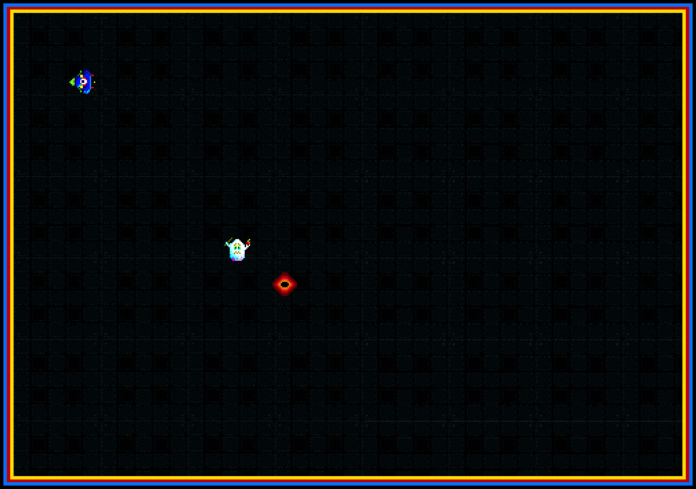

# Ghost Spawner 

# TODO
- UML relaatiot
- loppuraportti
- Text on screen
- highscore
- bullet damage
- player speed
- player stationary collision throwback bug
- final sounds
--------------------------
- Score & wave counter
- Better throwback
- Tests
- Async things
- GameStateMachine -> Stack
- player acceleration smooth
- collision box size
- Creadits
